# INTRODUCTION TO LINUX
The linux fundamental project shows the essentials of DevOps, Cloud computing, software development, cyber security, data analysis, science,  AI, and QA Testing ensuring that the student has a solid foundation in linux

## What is linux?
Linux is a free, open-source operating system similar to Windows or macOS, but it's more widely used for servers and supercomputers. It's known for its stability, security, and flexibility, allowing users to modify and distribute their versions. Linux runs on a wide range of devices, from desktops to smartphones, and powers much of the internet's infrastructure. it's supported by a global community of developers who contribute to its many distribution, each tailored for specific needs or preferences

## Linux Distribution
Linux distributions, often referred to as **distro**, are different flavours of the linux operation systems built using linux karnel. These distros package the linux karnel with a range of software, liberies, and tools to provide a functional computing environment. They offer different configurations, desktop eenvironments, package managers, and software repositories, and then they are branded. Some of the linux distribution are;

**Linux**: Ubuntu is one of the most widely recognized Linux distributions, known for its user-friendliness and ease of installation. It's an excellent choice for those new to linux, as well as for everyday desktop computing. Ubuntu has server editions for web hosting and cloud deployment.
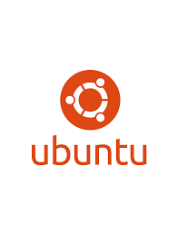

**CentOS**: CentOS is favoured in enterprise and server environments. It's a community-driven distribution based on the sources of Red Hat Enterprise Linux (RHEL). CentOS is known for its stability and long-term support, making it suitable for production servers.


**Debian**: Debian is a versatile and stable distribution that serves as the foundation for many other distributions, including Ubuntu. It's known for its extensive package repository and commitment to free software principles. Debian is often used for servers and desktops.


**Fedora**: Fedora is a cutting-edge distribution sponsored by Red Hat. It features the latest software and technologies, making it a great choice for developers and enthusiasts who want to stay on the bleeding edge of Linux innovation.


## Cloud Server Installation and Initial Setup 
To install a Linux distribution on a cloud server and gain access to from the local environment.

the setup looks like this.
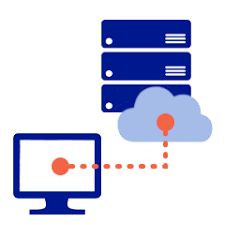

We will use AWS EC2 as our cloud server provider. AWS EC2 is a popular cloud computing service that allows users to run virtual servers in the cloud. It provides a wide range of instance types, operating systems, and configurations to suit various workloads.

## Creating an AWS EC2 Instance i.e a linux server
1. **Sign in to AWS Management Console**: Go to the [AWS Management Console](https://aws.amazon.com/console/) and sign in with your AWS account credentials.
2. **Navigate to EC2 Dashboard**: In the AWS Management Console, search for "EC2" in the services search bar and select "EC2" to access the EC2 Dashboard.
3. **Launch Instance**: Click on the "Launch Instance" button to start the instance
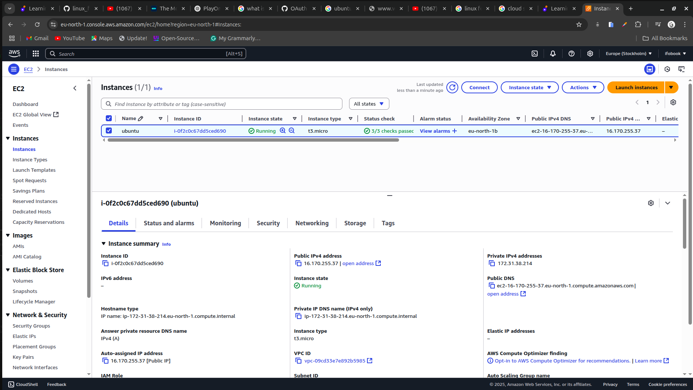

coping my ssh username
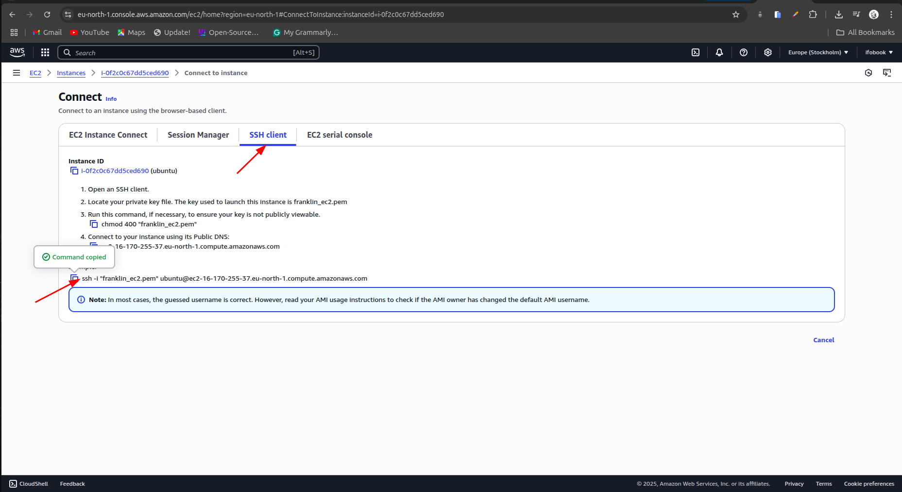

connecting to my ec2 instance from my local machine
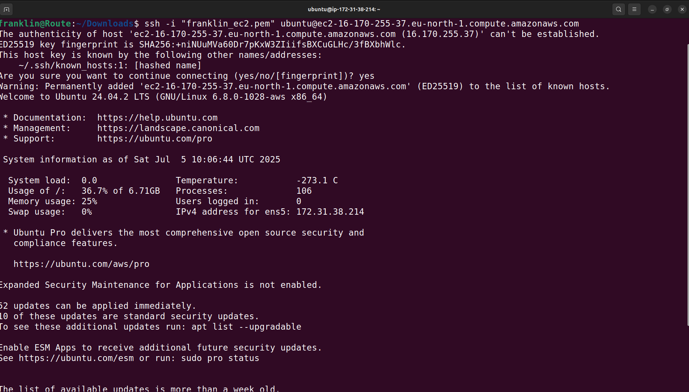

## Installing, updating and removing softwares
To install, update, and remove software on a Linux server, you typically use the package manager specific to the distribution you're using. For example, on Debian-based distributions like Ubuntu, you would use `apt`, while on Red Hat-based distributions like CentOS, you would use `yum` or `dnf`.
updating my ec2 instance

1. **Update Package Lists**: Before installing any software, it's a good practice to update the package lists to ensure you have the latest information about available packages.
   ```bash
   sudo apt update
   ```
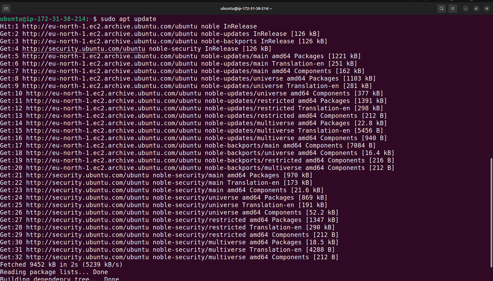

2. **Install Software Package**: To install a software package, use the following command:
   ```bash
   sudo apt install tree
   ```
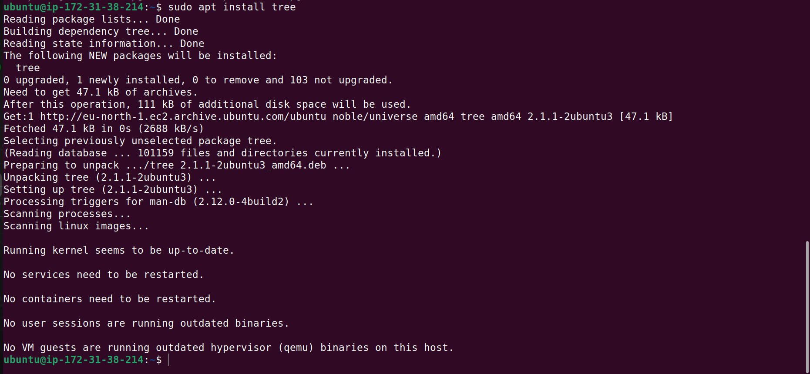

3. **Verifying that tree is installed**: After installation, you can verify that the software is installed by checking its version or running it.
   ```bash
   tree --version
   ```
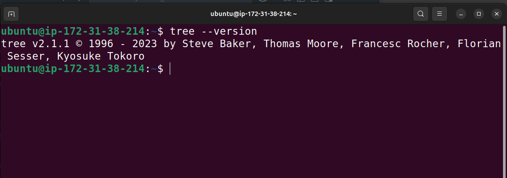

playing with tree
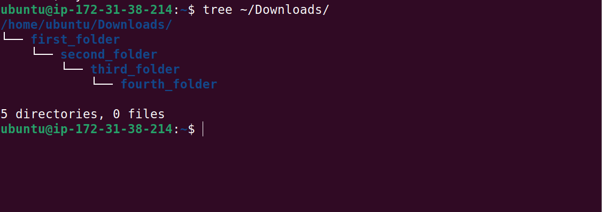

4. **Updating Installed Packages**: To update all installed packages to their latest versions, use the following command:
   ```bash
   sudo apt upgrade
   ```
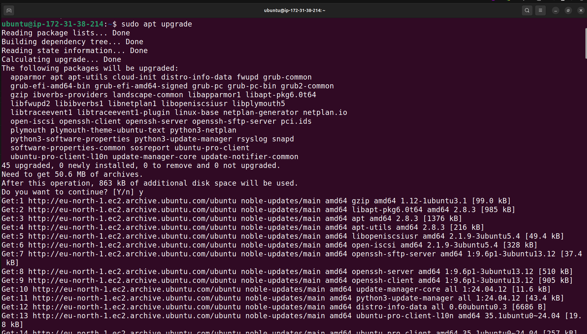

5. **Removing Software Package**: If you want to remove a software package, you can use the following command:
   ```bash
   sudo apt remove tree
   ```
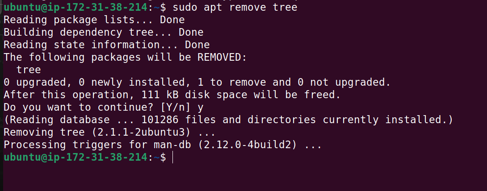


